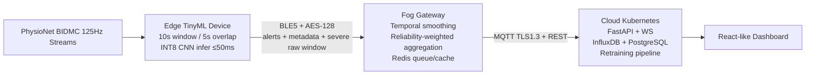

# Edge-Fog-Cloud Architecture Plan

## Phase Execution
1. Data pipeline: filtering, normalization, features, patient-wise split.
2. CNN training using mandated Conv1D architecture.
3. 40% pruning + INT8 conversion and TinyML envelope checks.
4. Edge simulation with 125Hz stream and thresholded alerting logic.
5. Fog aggregator with severe bypass and false-positive filtering.
6. Cloud REST/WS APIs with database-ready deployment.
7. Dashboard for real-time and trend review.
8. Baseline vs hierarchical benchmark.
9. Final constraints validation.
